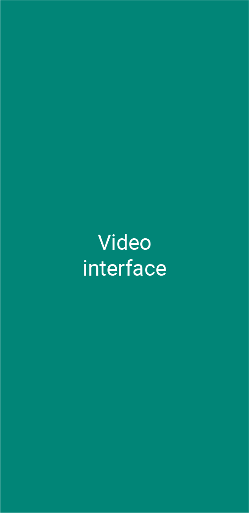
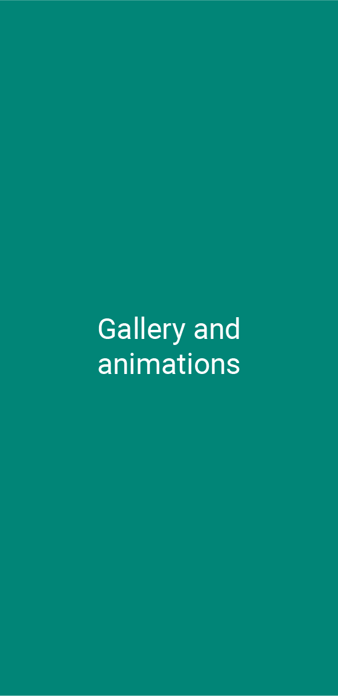
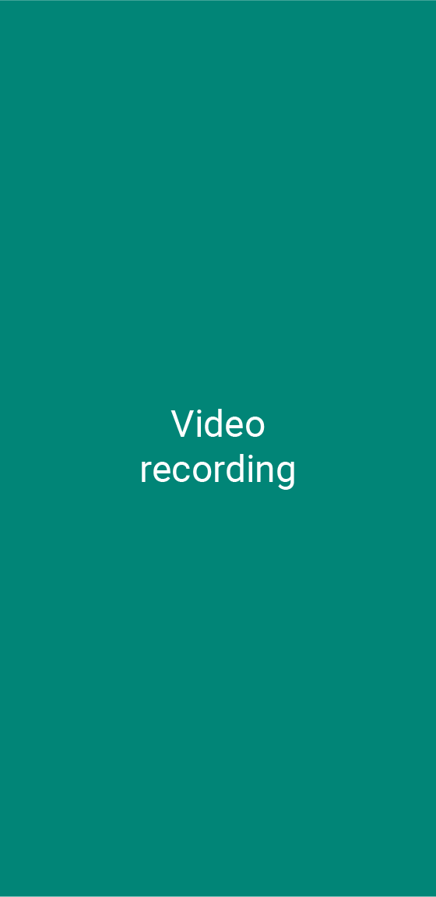

<h1>Video record gallery demo app</h1>
<h2>Android (Kotlin)</h2>
<b>Main tools</b>
<ul>
<li>MediaStore</li>
<li>Camera Intent</li>
<li>Shared Transitions</li>
</ul>

<h1>Description</h1>

This app is as simply as a video gallery can be. It allows to capture new videos and watch the existing ones

The videos are stored on a custom folder in the external memory of the device, so are public and visible to others apps of the system like the default gallery

Shared Transitions are used to make the changes between galley and video previews more smoth and fluid

Academic demo app, this app is not completely debugged, it's just a demo. It could contain not extracted text strings and not properly indented code

<h1>Screenshots</h1>

  
  
  

<h1>Demo *</h1>

*A higher quality and longer video opens on YouTube when clicked

  
  

 

  
  

 

  
   

